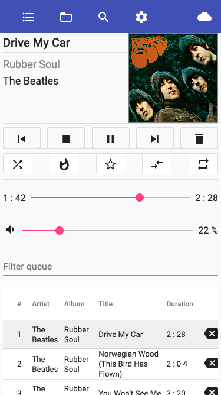

# ampd

ampd is a web-based client for [MPD](https://www.musicpd.org/). It is build with `Angular` and
`Spring Boot`.

## Screenshots

Desktop (dark theme)             |  Mobile (light heme)
:-------------------------:|:-------------------------:
  | 

## Running

Requires Java 11. To run ampd, just run the `jar`-file:

```shell script
java -jar ampd.jar
```

Additional options can be passed via the `-D` arguments, for example:

```shell script
# Music dir is located at /home/foo/music
java -jar -Dmpd.music.directory=/home/foo/music ampd.jar

# Combine multiple properties, MPD runs on port 5500 and access MPD server on 'myhostname'
java -jar -Dmpd.port=5500 -Dmpd.server=myhostname ampd.jar
```

To persist these options, create a config file. See chapter `Installation`.

## Using

### Shortcuts

`ampd` has some shortcuts built in:

* `<space>` or `p`: Pauses the current running song. If the browser focus is on another button, that button may be triggered.
* `<arrow left>`: Previous song.
* `<arrow right>` Next song.
* `f`: Sets the focus to the filter. This is enabled on both the `Queue` and `Browse` view.
* `1`: Navigate to the queue view
* `2`: Navigate to the browse view
* `3`: Navigate to the search view
* `4`: Navigate to the settings view

## Installation

Download a release from [here](https://github.com/rain0r/ampd/releases) ([mirror](https://static.hihn.org/dl/ampd/)).

Since `ampd` is distributed as a single `jar`-file, it doesn't need a traditional installation.
Just copy it wherever you like. I would recommend `/opt/ampd/ampd.jar`.

To overwriter any property from `application.properties` you can place a config file
under `/opt/ampd/ampd.conf` which contains additional parameters, for example:

```shell script
# File: /opt/ampd/ampd.conf
# See src/main/resources/application.properties for a full list
JAVA_OPTS="-Dspring.profiles.active=prod"
# If you have multiple JRE installed 
JAVA_HOME="/opt/openjdk-bin-11.0.6_p10/" 
```

**Caveats**  
The properties in `ampd.conf` are only applied if...

* ...`ampd` is startet via `./ampd.jar start`
* ... the `conf`-file has the same name as the `jar`-file (except the ending, of course)

### Installation as a service

#### init.d

The jar file can be used as a service out-of-the-box. Just create a symlink to `/etc/init.d`
and you're good to go:

```shell script
ln -sf /opt/ampd/ampd.jar /etc/init.d/ampd
/etc/init.d/ampd start
```

If you get the error: `start-stop-daemon: unrecognized option '--no-close'`, remove that
option from the jar-file with: `sed -i 's/--no-close//g' /opt/ampd/ampd.jar`

#### systemd

Create the file `/etc/systemd/system/ampd.service`

```shell script
[Unit]
Description=ampd
After=syslog.target

[Service]
User=ampd # <<<--- Change to a user on your system 
ExecStart=/opt/ampd/ampd.jar
SuccessExitStatus=143

[Install]
WantedBy=multi-user.target
```

Afterwards, start it immediately with `systemctl start ampd.service`.
If you wish, to start `ampd` at the next boot, enable it with `systemctl enable ampd.service`.

### Installation behind another webserver (apache and nginx)

Please see [DEPLOYING.md](DEPLOYING.md)
