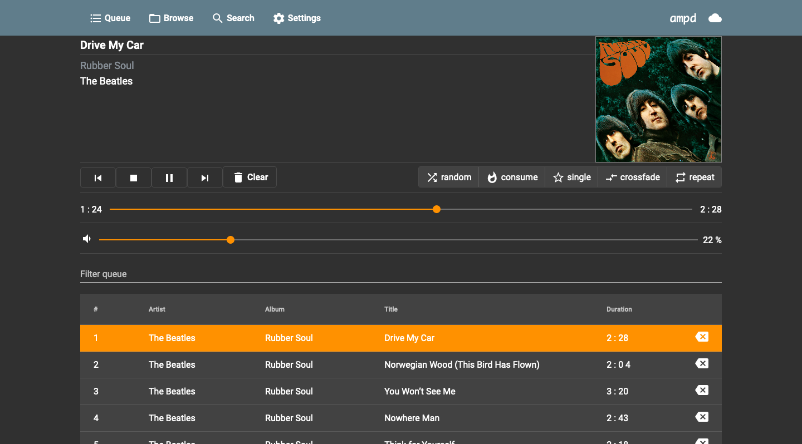

# ampd

ampd is a web-based client for [MPD](https://www.musicpd.org/). It is build with `Angular` and `Spring Boot`.


## Screenshots

Desktop             |  Mobile
:-------------------------:|:-------------------------:
  |  


## Installation

Since `ampd` is distributed as a single `jar`-file, it doesn't need a traditional installation. Just copy it wherever you like. I would recommend `/opt/ampd/ampd.jar`. If you like, you can place a config file under `/opt/ampd/ampd.conf` which contains additional parameters, for example:

```
$ cat /opt/ampd/ampd.conf
JAVA_OPTS="-Dspring.profiles.active=prod" # see application.properties for a full list
JAVA_HOME="/opt/openjdk-bin-11.0.6_p10/" # if you have multiple JRE installed
```

**Caveats:**  
The properties in `ampd.conf` are only applied if... 

 - ...`ampd` is startet via `./ampd.jar start`
 - ... the `conf`-file has the same name as the `jar`-file (except the ending, of course) 

## Running

Requires Java 11. To run ampd, just run the `jar`-file:

```
java -jar ampd.jar
```

Additional options can be passed via the `-D` arguments, for example:

```
java -jar -Dserver.port=8082 ampd.jar
```

More examples

```
# Music dir is /home/foo/music
java -jar -Dmpd.music.directory=/home/foo/music ampd.jar

# MPD runs on localhost:5500
java -jar -Dmpd.port=5500 ampd.jar

# Combine multiple properties, listen only on localhost and access MPD server on 'myhostname'
java -jar -Dserver.address=localhost -Dmpd.server=myhostname ampd.jar
```

To persist these options, create a config file. See chapter `Installation`.

For a full list of options, see [`application.properties`](src/main/resources/application.properties)

# Using
## Shortcuts

`ampd` has some shortcuts built in:

 * `<space>`: Pauses the current running song. If the browser focus is on another button, that button may also be triggered.
 * `<arrow right>` Next song. If you previously set the volume with the mouse, the shortcut may instead *increase* the volume.
 * `<arrow left>`: Previous song. If you previously set the volume with the mouse, the shortcut may instead *decrease* the volume.
 * `f`: Sets the focus to the filter. This is enabled on both the `Queue` and `Browse` view.

# Hacking
## Building from source

If you like to hack around or just build from source, clone this repository:

```
git clone https://github.com/rain0r/ampd
```

To get a fully runing `ampd` you have two take these two steps:

1. Build the Angular frontend
2. Build the whole Spring Boot application


First, let's get the frontend working. We're assuming that you already have a working `ampd` instance (check `Release` for that).

```
cd angularclient/
npm install 
ng serve
```

This should get you started, you can see the UI at `http://localhost:4200/webpack-dev-server/` but `ampd` won't connect to the backend server. So let's fix that.

Open the file `angularclient/src/environments/environment.ts` and set change `AMPD_URL` in the first line to your computer name or ip. Run `ng serve` again and - provided there is a `ampd` instance running on that computer - the frontend will connect to that. 

Now let's take a look at the backend server, which is using Spring Boot. To get it all up and running, just hit `mvn spring-boot:run` and let Maven do the magic. 

Of course, there is not much to see for now, the html-files are missing. The development workflow looks like this:

1. Start the backend via `mvn spring-boot:run` on any port you like, let's say `foobar:8888`
2. Start the frontend via `ng serve` and make sure you set `foobar:8888` as `AMPD_URL` in the file `angularclient/src/environments/environment.ts`

To create a full relase, make use of the script `angularclient/build.js`:

```
$ node build.js --help
Build the ampd frontend.

Options:
  --help     Show help                                                 [boolean]
  --version  Show version number                                       [boolean]
  --prod     Is this a production build?              [boolean] [default: false]
  --url      The url of the backend server       [string] [default: "localhost"]
  --https    use https instead of http                [boolean] [default: false]
  --context  The context path of ampd                    [string] [default: "/"]
```

So, for example, you want to build `ampd` for yourself with these options:

- It should be a production build
- `ampd` should be accessible via the url `https:punica:8003/my-music`
- It should use `https` and `wss`

This would be realized via: 

```
node build.js --prod=true --url=punica:8003 --https=true --context=/my-music/
```

After that, the dist files will automatically be copied in `src/main/resources/static` so you can just start the backend server or do a complete build via `mvn install` and run the resulting jar file.
